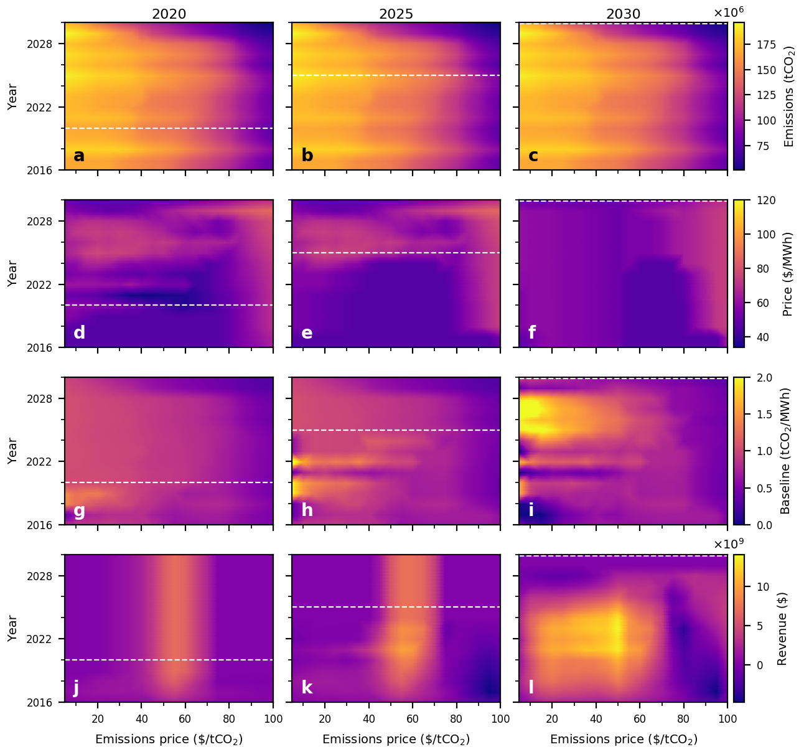

# Price targeting under a Refunded Emissions Payment scheme
A Refunded Emissions Payment (REP) scheme requires generators pay for each unit of CO2 emitted, with collected payments refunded back to generators in proportion to their energy output. This scheme has been used in Sweden to reduce NOx emissions [1]. The net effect of the scheme is to penalise (reward) generators with emissions intensities above (below) the average emissions intensity of energy produced by all generators under the policy's remit.

Code in this repository examines how a modified REP scheme can be calibrated to target wholesale electricity prices in the years following scheme implementation. This approach allows an emissions price to be established while having a muted impact on wholesale electricity prices. At a high-level, the scheme relaxes the requirement of revenue neutrality for individual years over a transitional period, but enforces an aggregate constraint on scheme revenue over the transitional period. This allows the scheme to run at a surplus or deficit for individual years (unlike a standard REP scheme), but aggregate revenue is enforced to be non-negative by the end of the transitional period. This flexibility to run the scheme at surplus or deficit allows wholesale prices to be targeted.

The REP scheme is examined within the context of a generation expansion planning (GEP) framework, with optimisation models developed to identify policy parameter trajectories that target wholesale electricity price outcomes. Data describing Australia's National Electricity Market (NEM), obtained from , are used when implementing the models.

A summary of the program's components is as follows:

| Folder | Description |
| ------ | ----------- |
| `data/files` | Underlying data used in the analysis.|
| `src/1_collect_data`| Scripts used to extract and parse data to be used in the GEP model. |
| `src/2_input_traces`| A clustering algorithm is used to construct a set of representative days.|
| `src/3_model/linear` | GEP model is implemented via `controller.py` to run different cases.|
| `src/4_analysis` | Model results are examined and plotted. Utility scripts are also included to analyse model results. |

A combination of optimisation models and sensitivity analyses are used to examine the impact of different policy parameter trajectories on wholesale price, emissions, and scheme revenue outcomes. An example of output returned by the models is as follows:

## References
[1] T. Sterner, L. Höglund Isaksson, Refunded emission payments theory, distribution of costs, and Swedish experience of NOx abatement, Ecological Economics 57(1) (2006) 43-56.
